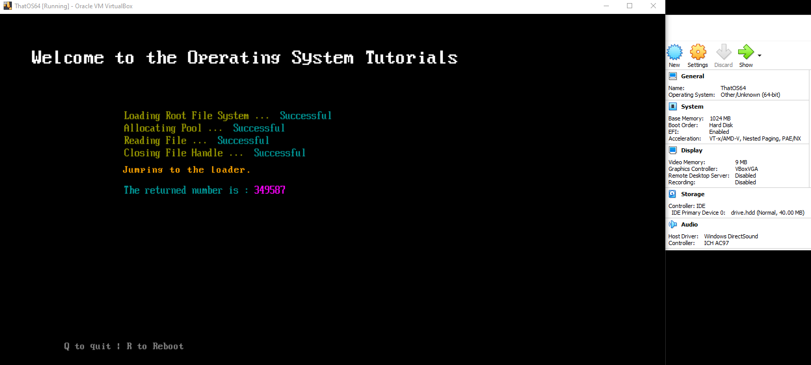
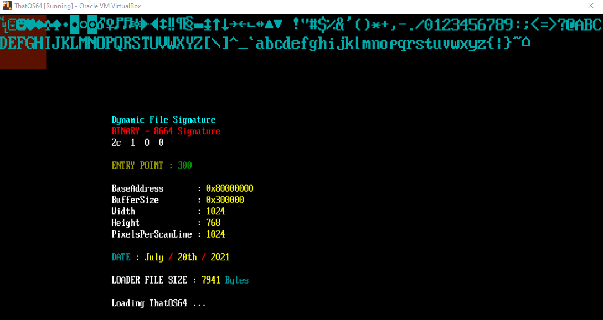
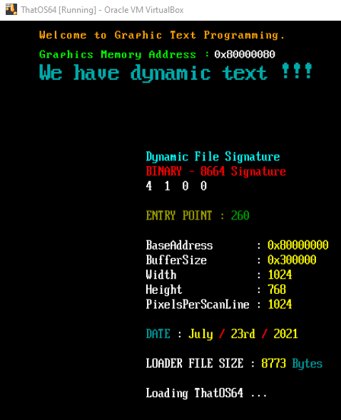
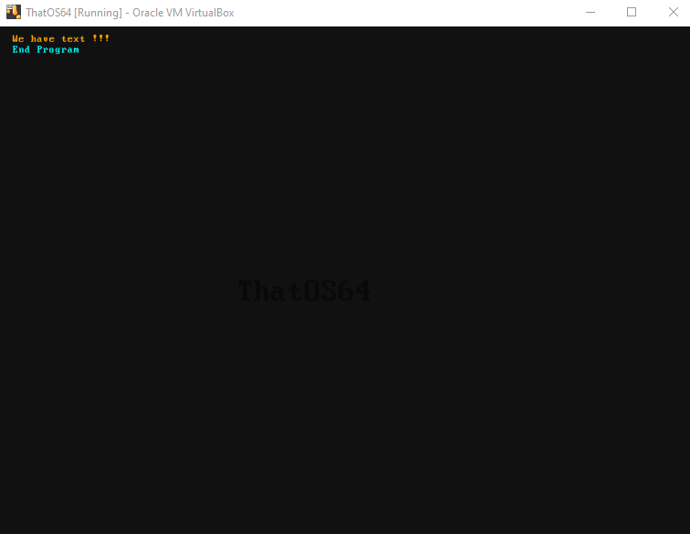
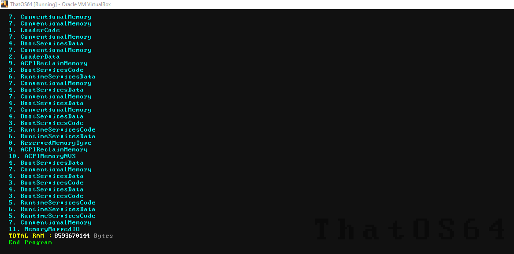

# Step by Step Tutorials on how to code a 64-Bit loader and kernel for OS Development  

# NOTES  
- WARNING - This code is for teaching purposes only. It is not written for professional use. Some code is written in order to speed up teaching, and thus is not properly coded. You should rewrite the code for your own professional use.  
- Starting with CODE5, the resolution from the EFI file sets the screen height and width to 1920x1080.
- Although this can work on real hardware, I do NOT recommend doing so unless you know what you are doing. Use virtualbox or qemu until **you know** you have solid working code.
- For CODE1, you will need the BOOTX64.EFI file from my other GitHub Repo. https://codeberg.org/ThatOSDev/UEFI-Tuts  
- The drive.hdd file is included, I didn't realize this when I made the first video.  
- The bios64.bin file is for qemu to work. Otherwise QEMU will fail to load.  
- Although the BUILD INSTRUCTIONS shows Windows, MAC or Linux, this tutorial series is using a windows host. However all code and makefile command switches should all work if you follow the build instructions.  

# TOOLS NEEDED  
- OSFMount ---- https://www.osforensics.com/tools/mount-disk-images.html  
- QEMU ( Optional ) ---- https://www.qemu.org/  
- VirtualBox ( Optional ) ---- https://www.virtualbox.org/  
- GCC for windows ---- https://nuwen.net/mingw.html  

# BUILD INSTRCUTIONS  
[https://codeberg.org/ThatOSDev/UEFI-Tuts/src/branch/master/BUILD.md](https://codeberg.org/ThatOSDev/UEFI-Tuts/src/branch/master/BUILD.md)  

# READ THIS !!!
- THINGS YOU SHOULD KNOW BEFORE STARTING OS DEVELOPMENT  
    - The C Language  
    - Assembly Language  
    - How to read Hex Code ( Example : 0x8664 )  
    - How your Host Operating System works ( Such as windows or linux )  
    - How your compiler works ( Such as GCC )  
    - How to do research ( Don't be lazy )  
- **BEGINNER MISTAKES** : [https://wiki.osdev.org/Beginner_Mistakes](https://wiki.osdev.org/Beginner_Mistakes)  


# STRUCT FROM THE EFI BOOTLOADER
**NOTE: This is current starting with CODE5**  
```c
typedef struct BLOCKINFO
{
    uint64_t               BaseAddress;
    uint64_t               BufferSize;
    uint32_t               ScreenWidth;
    uint32_t               ScreenHeight;
    uint32_t               PixelsPerScanLine;
    uint64_t               LoaderFileSize;
    EFI_MEMORY_DESCRIPTOR* MMap;
    uint64_t               MMapSize;
    uint64_t               MMapDescriptorSize;
    uint64_t*              rsdp;
} __attribute__((__packed__)) BLOCKINFO;
```
  
# TUTORIALS
- RIGHT CLICK THE LINKS AND OPEN IN NEW TAB  
	- INITIAL SETUP &nbsp;&nbsp; &nbsp; &nbsp; &nbsp; &nbsp; &nbsp; &nbsp; &nbsp; &nbsp; &nbsp; &nbsp; &nbsp; &nbsp; &nbsp; &nbsp;&nbsp; &nbsp; &nbsp; &nbsp; &nbsp; &nbsp; &nbsp; &nbsp; &nbsp; &nbsp; &nbsp; &nbsp; &nbsp; &nbsp; &nbsp; &nbsp; ---  [CODE1](https://codeberg.org/ThatOSDev/ThatOS64/src/branch/master/src/code1)  
	- ABI INTERFACE &nbsp; &nbsp; &nbsp; &nbsp; &nbsp; &nbsp; &nbsp; &nbsp; &nbsp; &nbsp; &nbsp;&nbsp; &nbsp; &nbsp; &nbsp; &nbsp; &nbsp; &nbsp; &nbsp; &nbsp; &nbsp; &nbsp; &nbsp; &nbsp; &nbsp; &nbsp; &nbsp; &nbsp; &nbsp; &nbsp; &nbsp; ---  [CODE2](https://codeberg.org/ThatOSDev/ThatOS64/src/branch/master/src/code2)  
	- GRAPHIC TEXT &nbsp;&nbsp; &nbsp; &nbsp; &nbsp;&nbsp; &nbsp; &nbsp; &nbsp; &nbsp; &nbsp; &nbsp;&nbsp; &nbsp; &nbsp; &nbsp; &nbsp; &nbsp; &nbsp; &nbsp; &nbsp; &nbsp; &nbsp; &nbsp; &nbsp; &nbsp; &nbsp; &nbsp; &nbsp; &nbsp; &nbsp; &nbsp; ---  [CODE3](https://codeberg.org/ThatOSDev/ThatOS64/src/branch/master/src/code3)   
	- ORGANIZATION AND TEXT POSITION &nbsp; &nbsp; &nbsp; &nbsp; &nbsp; &nbsp; &nbsp; &nbsp; &nbsp; &nbsp; &nbsp; &nbsp; ---  [CODE4](https://codeberg.org/ThatOSDev/ThatOS64/src/branch/master/src/code4)  
	- GDT & MMAP &nbsp; &nbsp; &nbsp; &nbsp; &nbsp; &nbsp; &nbsp; &nbsp; &nbsp; &nbsp; &nbsp; &nbsp; &nbsp; &nbsp; &nbsp; &nbsp; &nbsp; &nbsp; &nbsp; &nbsp; &nbsp; &nbsp; &nbsp; &nbsp; &nbsp; &nbsp; &nbsp; &nbsp; &nbsp; &nbsp; &nbsp; --- [CODE5](https://codeberg.org/ThatOSDev/ThatOS64/src/branch/master/src/code5)  
	- PAGING  &nbsp;&nbsp; &nbsp; &nbsp; &nbsp; &nbsp; &nbsp; &nbsp; &nbsp; &nbsp; &nbsp; &nbsp; &nbsp; &nbsp; &nbsp; &nbsp; &nbsp; &nbsp; &nbsp; &nbsp; &nbsp; &nbsp; &nbsp; &nbsp;&nbsp;&nbsp;&nbsp;&nbsp;&nbsp;&nbsp;&nbsp;&nbsp;&nbsp;&nbsp;&nbsp;&nbsp;&nbsp;&nbsp;&nbsp;&nbsp;&nbsp;&nbsp;&nbsp;&nbsp;&nbsp;&nbsp;&nbsp;&nbsp;&nbsp; ---  [CODE6](https://codeberg.org/ThatOSDev/ThatOS64/src/branch/master/src/code6) 


  

  

  

  

  
 
